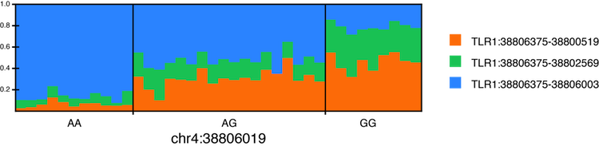

.. SplicePlot documentation master file, created by
   sphinx-quickstart on Mon Jul  8 16:05:23 2013.
   You can adapt this file completely to your liking, but it should at least
   contain the root `toctree` directive.
.. toctree::
   :maxdepth: 2

SplicePlot: a tool for visualizing alternative splicing
========================================================
SplicePlot is a tool for visualizing alternative splicing and the effects of
splicing quantitative trait loci (sQTLs) from RNA-seq data. It provides a simple command line
interface for drawing sashimi plots, hive plots, and structure plots of
alternative splicing events from .bam, .gtf, and .vcf files.

Updates
=======
**30 July 2013:** Version 1.0 available here

**14 October 2013:** Version 1.1 is now available. Check the Github page for changes.

Dependencies
============

**Python requirements:**

* `Python 2.6 or newer <http://www.python.org/download/releases/>`__ . If running Python 2.6, download and install the `argparse module <https://pypi.python.org/pypi/argparse>`__
* `numpy version 1.7.1 or newer <http://www.numpy.org/>`__
* `scipy version 0.11.0 or newer <http://www.scipy.org/>`__
* `matplotlib version 1.2.0 or newer <http://matplotlib.org/index.html>`__
* `pandas version 0.11.0 or newer <http://pandas.pydata.org/>`__
* `pysam version 0.7 or newer <http://code.google.com/p/pysam/>`__

**Other requirements:**

* `SAMtools <http://samtools.sourceforge.net/>`__ must be installed and be in your $PATH
* `Tabix <http://sourceforge.net/projects/samtools/files/tabix/>`__ must be installed and be in your $PATH

Source Code
===========

* Source code is available here: `https://github.com/wueric/SplicePlot <https://github.com/wueric/SplicePlot>`__

Installation
============

1. Install the above dependencies.

2. Download the `SplicePlot .zip` and unpack the archive in the desired directory

3. Check if all of the necessary Python packages are available by running the command ``python check_module_availability.py`` in the *SplicePlot* directory.

VirtualBox Virtual Machine Instructions
=======================================

1. Download `VirtualBox <https://www.virtualbox.org/>`__ and install it.

2. Download the SplicePlot Ubuntu virtual machine from here.

	* `Large VM loaded with the Montgomery et al, Nature, 2010 BAMs (60Gbs!!) <http://py-gi1.stanford.edu/~smontgom/SplicePlotVM.ova>`__

	* `Small VM loaded with the Montgomery et al, Nature, 2010 BAMs for chr20 (2.5Gb) <http://py-gi1.stanford.edu/~smontgom/SplicePlotReducedVM.ova>`__

3. Open VirtualBox, and import the virtual machine.

4. Start up the virtual machine. Open a terminal window, and SplicePlot can be run from the command line.

Testing SplicePlot
===================
A sample pickle file containing simulated data has been provided in the directory *test_files*. To test SplicePlot, run the command ``python plot.py test_files/test.p pickle settings_file`` in the *SplicePlot* directory. If all goes well, three plots should appear in the *plots* directory.

A sample table file containing simulated data is also provided in *test_files*. Run teh command ``python plot.py test_files/test_table table settings_file`` in the *SplicePlot* directory. If all goes well, two plots should appear in the *plots* directory.

Overview
========

Sashimi plots
-------------

.. figure:: images/sashimi_sample.png
	:align: center

`Sashimi plots <http://arxiv.org/abs/1306.3466>`__ first appeared as a part of the `MISO package <http://genes.mit.edu/burgelab/miso/docs/index.html>`__ developed by Katz et. al. in 2010. They allow for the easy comparison of read depth, alternative splicing, and isoform structure between individual RNA-seq samples.

SplicePlot produces modified sashimi plots for the visualization of sQTLs in a population. Rather than plotting data for each individual sample, SplicePlot groups the samples by genotype at a particular locus and then plots averages by genotype. This allows for the comparison of alternative splicing and isoform structure between groups within a population.

The average read depths (average number of reads covering each base) and the average number of reads spanning each splice junction are then calculated for each group from the mapped reads. Average read depths, expressed in number of reads, are plotted and color coded based on genotype, which is labelled in the upper right corner. The reads spanning each junction are represented by arcs linking exonic regions, and each arc is labelled with the average number of reads spanning that particular junction. The thickness of each arc is proportional to the average number of reads spanning the particular junction. At the bottom of the plot, possible mRNAs are drawn, allowing for the easy comparison of isoform structure. The title of the plot corresponds to the particular locus being plotted.

Splicing ratios
---------------

Both the hive plot (`Hive plots`_) and structure plot (`Structure plots`_) rely on the splicing ratio, defined below. Intuitively, the splicing ratio is the ratio of reads spanning a particular splice junction to the total number of reads containing the same 5' splice site (or, alternatively, the same 3' splice site).

.. math::

	\textit{splicing ratio} = \frac{\textit{reads spanning junction}}{\textit{total number of reads sharing the same splice site}}

The sum of all of the splicing ratios for a given 5' (or 3') splice site should be 1. For example, for the transcript with two alternative isoforms illustrated below,

.. figure:: images/exons.png
	:align: center

the splicing ratios would be

.. math::

	\textrm{SR}_{E1-E2} &= \frac{\textrm{reads spanning E1-E2}}{\textrm{reads spanning E1-E2} + \textrm{reads spanning E1-E3}}\\\\
	\textrm{SR}_{E1-E3} &= \frac{\textrm{reads spanning E1-E3}}{\textrm{reads spanning E1-E2} + \textrm{reads spanning E1-E3}}

Hive plots
----------

.. figure:: images/hive2.png
	:align: center
	

`Hive plots <http://www.hiveplot.net/>`__ provide an easy way to compare splicing ratios across a population. Each individual is represented as a set of connected arcs going around the plot, color coded by the individual's genotype at a particular locus. On each of the radial axes, the splicing ratios for a particular splice junction are shown, and the distance from the center of the plot is proportional to the magnitude of the splicing ratio. Each axis is labelled with the name (chromosome and coordinates) of the splice junction.

Structure plots
---------------

Structure plots are an alternate way of visualizing splicing ratios and comparing them across a population. Here, individuals are spatially grouped by their genotype at a particular locus. Splicing ratios for each individual are illustrated with vertically stacked bars, with the height of each bar representing the splicing ratio for a particular junction. The bars are color coded by junction. 

Running SplicePlot
===================

From raw data
-------------

Input files
~~~~~~~~~~~
SplicePlot requires several text files as input:

1. A .vcf file which has been sorted, bgzipped, and indexed using tabix. To prepare this from an original .vcf file called *sample.vcf*, first sort the .vcf file by position. This can be done using ``vcf-sort`` from `VCFtools <http://vcftools.sourceforge.net/>`_. Then run the command ``bgzip sample.vcf``, followed by the command ``tabix -p vcf sample.vcf.gz`` These commands will produce two files, *sample.vcf.gz*, which is the bgzipped version of *sample.vcf*, and *sample.vcf.gz.tbi*, which is the tabix index file for *sample.vcf*.

2. A .gtf annotation file containing only exons which has been sorted by position, bgzipped, and then indexed using tabix. The .gtf file can be downloaded from online sources like `UCSC <http://genome.ucsc.edu/cgi-bin/hgTables?command=start>`_, or created manually. To process a .gtf file into the format required by SplicePlot, run the command ``python prepare_annotation.py input.gtf output.gtf`` This command will produce a bgzipped file called *output.gtf.gz* and tabix index file called *output.gtf.gz.tbi*. The annotation file can also be filtered and sorted by the user using utilities like ``sort`` and ``awk``, and then compressed and indexed using ``bgzip`` and ``tabix``.

3. .bam files containing the aligned RNA-seq data. These files should have been produced by a mapper that is capable of mapping reads spanning alternative splicing junctions, such as Tophat or STAR. The .bam files must be sorted by position, which can be accomplished using the command ``samtools sort in.bam out.bam``, and indexed (must have corresponding .bai file in the same directory), which can be accomplished using the command ``samtools index alignment.bam``.

4. A mapping file which assigns the individual IDs from the .vcf to file paths for the .bam files.  The first column contains the individual ID from the .vcf file, and the second column contains the location of the .bam file corresponding to that individual. The columns are separated by some sort of whitespace, preferably tabs. An example::

	Individual_ID /path/to/bam/file.bam
	Another_ID /path/to/other/bam/file.bam

.. warning::
	Different databases may name their chromosomes differently. For example, chromosome 1 may be named ``chr1`` in one annotation and ``1`` in another. Try to keep the naming conventions consistent in your input files. When inputting genomic coordinates into SplicePlot, make sure to use names consistent with those in your input files, or you may get some unexpected errors.

Drawing the plots
~~~~~~~~~~~~~~~~~
In order to run, SplicePlot must first extract and pickle the data relevant to a particular junction and SNP. After the data is extracted from the original files and pickled, the plotter loads the data and creates the images in .svg format.

1. Prepare the input files according to the specifications in `Input files`_.

2. Extract the features and write them to a pickle file using the command similar to ``python initialize_data.py chr1:10583 chr1:17055-17915,chr1:17055-17606,chr1:17055-17233 --vcf vcf_file.vcf.gz --gtf gtf_file.gtf.gz --mf map_file.txt`` The first positional argument is the location of the SNP, in the format chromosome:position. The second positional argument provides the name of the junction being plotted, in the format chromosome:lower_splice_site-upper_splice_site,chromosome:lower_splice_site-upper_splice_site. The ``--vcf`` argument provides the location of the .vcf.gz file produced by ``bgzip``, and the ``--gtf`` argument provides the location of the .gtf.gz file produced by ``prepare_annotation.py``. The ``--mf`` argument provides the location of the mapping file. There is an optional argument ``--output`` which allows the user to specify the location and name of the resulting pickle file. By default, the pickle file is stored in the *pickle_files* directory within the *SplicePlot* directory, and is named according to the SNP location and the provided junction name.

3. Draw the plots using a command similar to ``python plot.py pickle/file/location.p pickle settings_file`` The structure of the settings file is detailed below in `Creating the plot settings file`_, and a sample settings file is located in the *SplicePlot* directory. By default, the plots are saved to the *plots* directory within *SplicePlot*. There is an optional ``--output`` argument which allows the output directory to be specified.

Finding junctions from .BAM files
~~~~~~~~~~~~~~~~~~~~~~~~~~~~~~~~~
SplicePlot can find and output possible alternative splicing junctions within a provided window.

Run the command ``python junctions_from_window.py chr1:10000-chr1-20000 map/file/path``. The first positional argument is the window, in the format chromosome:lower_bound-upper_bound, and the second positional argument is the location of the mapping file. This mapping file has the same format as the mapping file provided to ``initialize_data.py``

This script will find all alternative junctions present in any of the provided BAM files.

From precalculated splicing ratios
----------------------------------

Formatting the table
~~~~~~~~~~~~~~~~~~~~

The table has the following format::

	indiv	genotype	CD46:207940540-207940952	CD46:207940540-207941124	CD46:207940540-207943666
	snia000367	GT	0.0147783251231527	0.574384236453202	0.410837438423645
	snia000398	TT	0.0195121951219512	0.808130081300813	0.172357723577236
	snia000650	TT	0.0335195530726257	0.815642458100559	0.150837988826816
	snia000899	GT	0.0153061224489796	0.512244897959184	0.472448979591837

The columns are separated by tabs. Individual ID is placed in the first column, genotype in the second, and splicing ratios in the remaining columns.

Drawing the plots
~~~~~~~~~~~~~~~~~
Draw the plots using a command similar to ``python plot.py pickle/file/location/table table settings_file``. The structure of the settings file is detailed below in `Creating the plot settings file`_, and a sample settings file is located in the *SplicePlot* directory. By default, the plots are saved to the *plots* directory within *SplicePlot*. There is an optional ``--ouput`` argument which allows the output directory to be specified. Note that only hive plots and structure plots can be created from table.

Creating the plot settings file
-------------------------------
Plotting parameters such as dimensions and font sizes are passed to SplicePlot using a settings file. An example settings file is located in the *SplicePlot* directory and is shown below::

	############ settings for drawing hive plot #################
	[hive_plot]

	# Whether or not a hive plot will be drawn
	draw_hive_plot = True

	# size of the plot in inches
	dimension = 8

	# tick mark settings
	# boolean determining whether tick marks are drawn
	tick_marks = True

	# font size of the tick labels in inches. Set to 0 if you do not want tick labels
	tick_label_font_size = 0.175

	# distance of the tick labels from the axis in inches
	tick_label_distance = 0.175

	# height of each tick in inches
	tick_height = 0.08

	# thickness (weight) of each tick in inches
	tick_thickness = 0.01

	# axis settings
	# start radius of axis in inches. Measured from the center of the plot
	axis_start_radius = 0.3

	# end radius of axis in inches. Measured from the center of the plot
	axis_end_radius = 2.75

	# string containing hexadecimal value for the axis color
	axis_colors = '#000000'

	# list containing the radii for each of the axis labels in inches, measured from center of the plot
	axis_label_radius = [3.25,3.25,3.25]

	# determines the font size of the axis labels, in inches
	axis_label_size = 0.2

	# determines the thickness of the axes, in inches
	axis_thickness = 0.05

	# determines the size of the subdivisions of the axis for tick marks
	axis_subdivision = 0.25

	# list containing the angles of each axis, in degrees. 0 is 3 o'clock
	axis_angles = [90,210,330]

	# list containing lists which determine the lower and upper bounds for each axis
	# set to [] if you do not want to use a custom scale
	custom_scale = [[0,1],[0,1],[0,1]]

	# bezier curve settings
	# list containing hexadecimal strings for the colors of the bezier curves
	bezier_colors = ['#FF8000','#00C866','#3399FF']

	# determines the thickness of the beziers, in inches
	bezier_thickness = 0.015

	# key settings
	# boolean determining whether a key should be drawn
	include_key = True

	# determines the font size of the key title, in inches
	key_title_size = .25

	# 2-element list containing the cartesian coordinates of the key, in inches. (0,0) is the center of the plot
	key_position = [1,2]

	# determines the font size of the text in the key, in inches
	key_font_size = .2

	# hexadecimal string determining the color of the font in the plot key
	key_text_color = '#000000'

	########### settings for structure plot ###################
	[struct_plot]

	# basic settings
	draw_struct_plot = True

	# dimensions in inches
	plot_width=9.2
	plot_height=3

	# amount of white space to leave on the left side, in inches
	left_margin=0.5

	# amount of white space to leave on the right side of the plot in inches.
	# Note that the key, if drawn, will be in this white space
	right_margin=3.45

	# amount of white space to leave on the top, in inches
	top_margin=0.2

	# amount of white space to leave on the bottom, in inches
	bottom_margin=1

	# colors for each junction. Must have as many colors as there are junctions in the data
	colors=["#CC0011","#FF8800","#FFCC33"]

	# color for the axis
	axis_color='#000000'

	# thickness for the axes, in inches
	axis_thickness=0.02

	# length of each tick mark in inches. Set to 0 if you do not want tick marks
	tick_length=0.1

	# size of the labels for the horizontal (x) axis in inches. Set to 0 if you do not want labels
	horiz_label_size=0.20

	# distance that horizontal axis labels are below the x axis, in inches
	horiz_label_spacing=0.25

	# font size for horizontal axis title in inches. Set to 0 if you do not want horizontal axis title
	horiz_axis_title_size=0.27

	# distance that horizontal axis title is below the x axis, in inches
	horiz_axis_title_spacing=0.50

	# determines whether or not tick marks are drawn for the vertical (y) axis
	use_vertical_ticks=True

	# spacing between tick marks on the vertical axis. must be between 0 and 1
	vertical_tick_spacing=0.25

	# font size for vertical axis labels, in inches. Set to 0 if you do not want labels
	vert_label_size=0.20

	# distance that vertical axis labels are drawn away from the vertical axis in inches
	vert_label_spacing=0.25

	# settings for structure plot key
	include_key = True

	# determines the font size of the key title. Use 0 if you do not want title
	key_title_size = 0

	# 2-element list containing the cartesian coordinates of the key in inches. (0,0) is the bottom left corner of the plot
	key_position = [6,2.25]

	# list containing the labels for each color in the key. Set to None if you want to use the default labels
	key_labels = None

	# determines the font size of the text in the key, in inches
	key_font_size = 0.2

	# hexadecimal string for the color of the font in the plot key
	key_text_color = '#000000'

	######### settings for sashimi plot ##############
	[sashimi_plot]

	draw_sashimi_plot = True

	# width of the sashimi plot, in inches
	width = 4

	# height of the sashimi plot, in inches
	height = 2.5

	# title. None means no title, '' means use default title, 'asdf' means title is 'asdf', etc
	plot_title = None

	# scaling factor for intronic regions. A larger intron_scale makes the intronic regions smaller
	intron_scale = 15

	# scaling factor for exonic regions. A larger exon_scale makes the exonic regions smaller
	exon_scale = 1

	# colors for the different pileups, in hex
	colors = ['#FF8000','#00C866','#3399FF']

	# maximum value on the y-scale
	ymax = 1800

	# determines whether the average junction-spanning read counts are shown
	number_junctions=True

	# determine the font size of the numbering for the junction-spanning reads
	numbering_font_size = 6

	resolution=0.5

	# determines the thickness of the junction-spanning beziers
	junction_log_base = 10

	# determines whether to reverse the plot if features are on the - strand
	reverse_minus = False

	font_size = 6

	# number of ticks on the y-axis
	nyticks = 2

	# number of ticks on the x-axis
	nxticks = 4

	# determines whether y-axis labels are drawn
	show_ylabel = True

	# determines whether x-axis labels are drawn
	show_xlabel = True

Common Errors
=============

1. **``initialize_data.py`` fails to run.**

	* Check to make sure that your argument for the variant position is correct, and that there is indeed a SNP in the .vcf file at that position. Also, make sure that the chromosome has been named correctly in your argument for the variant position (i.e. the chromosome name matches the name in the .vcf file).
	* Check to make sure that your argument for the junction name is correct. Make sure that the chromosome names in your argument for the junction match the names for the chromosome in the .gtf file.

2. **``initialize_data.py`` fails, with an error "X is not a valid splice site"**

	* Splice sites provided to ``initialize_data.py`` must have either a common donor or common acceptor.

References
==========

1. Hubisz, M. J., Falush, D., Stephens, M. & Pritchard, J. K. Inferring weak population structure with the assistance of sample group information. Molecular Ecology Resources 9, 1322–1332 (2009).

2. Katz, Y., Wang, E. T., Airoldi, E. M. & Burge, C. B. Analysis and design of RNA sequencing experiments for identifying isoform regulation. Nature Methods 7, 1009–1015 (2010).

3. Katz, Y. et al. Sashimi plots: Quantitative visualization of RNA sequencing read alignments. arXiv preprint arXiv:1306.3466 (2013). at `\<http://arxiv.org/abs/1306.3466> <http://arxiv.org/abs/1306.3466>`__

4. Krzywinski, M., Birol, I., Jones, S. J. & Marra, M. A. Hive plots--rational approach to visualizing networks. Briefings in Bioinformatics 13, 627–644 (2011).

